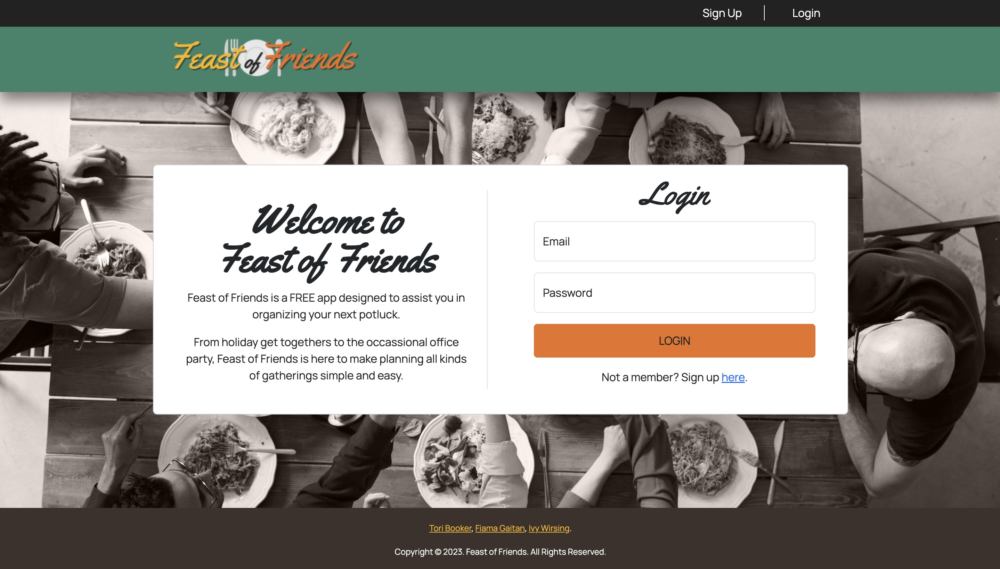
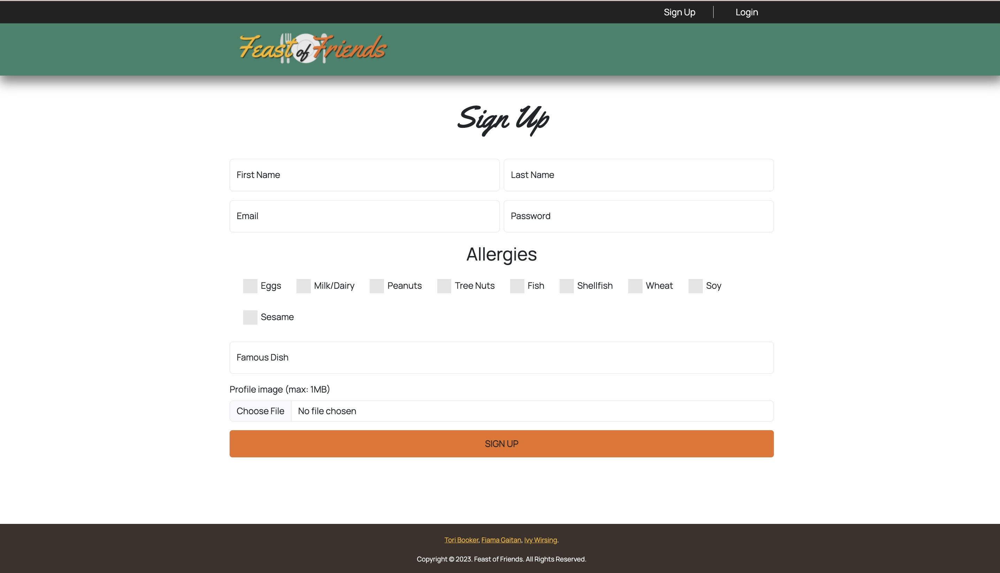
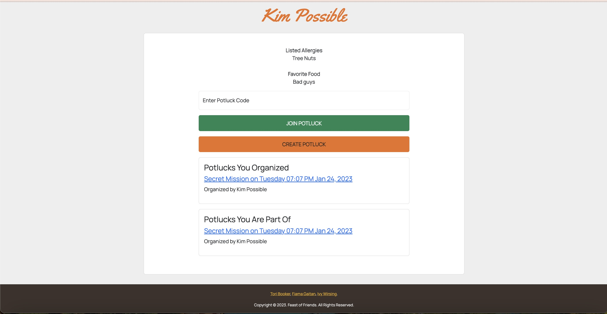
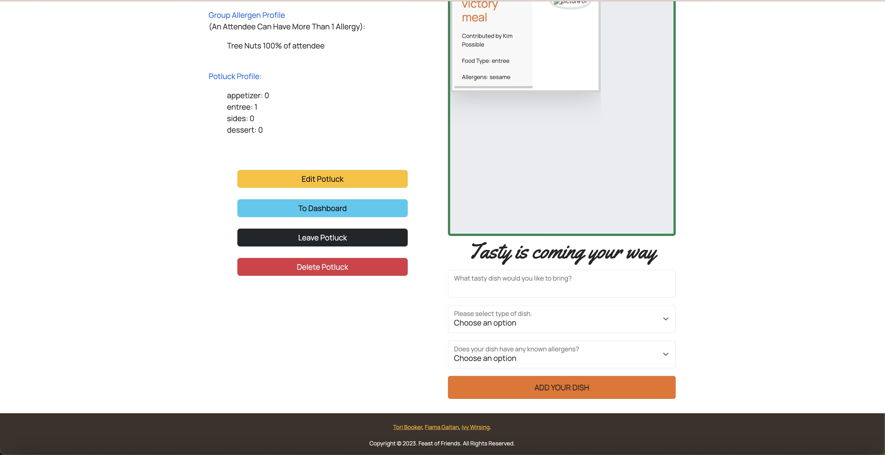
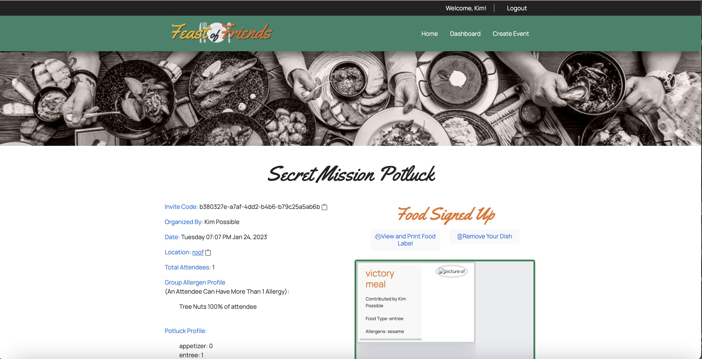

# Feast of Friends

## Description

The motivation behind a "Feast of friends" is to create a useful, handy application that allows a user to create potluck events. We took the inspiration from every day needs, but especifically in this case, what are our office needs? What could we use while working and spending time in the office? What could be helpful, or how could we make organizing office events better? This application is that.

We built this application because we wanted to create something useful and something that would be beneficial to many. We created something marketable that has some real use . Modt of all, this idea was fun and we wanted to explore what it could be. 

"Feast of friends" solves organizational events that could be centered around an office audience. But what if you're not involved in an office environment? This potluck application is geared towards anyone who benefits from its use. It is meant to help you organize your potluck events. The user has the ability to join a potluck or create their own potluck event. You can use this application for any event, Christmas parties and holidays, Friendsgiving, Galentines parties, camping, tailgating, and much more. 

This project has taught us that the possibilities are truly endless. As we dive deeper into the making of the application, we have recognized the need for more features which create more opportunities for the user to have a better experience utilzing this application. At the same time, we continuously become aware of the opportunities to make the application better by listening to the feedback of other's when using our application. We have a working deployment but it is not a complete application yet. There are more features that could be explored and implemented in the future and that would make this project prodigious. The features that were implemented for this submission were not shy of obstcales and challenges. From knowing what the code is doing, how the user's feedback is being captured and how it is being used within the application was the first challenge that we efficiently solved. We knew the user feedback builds onto the next event in our application. We knew it was important to capture user customization , so as developers we had to look and find ways and new technologies like Mutler to help us make our visions come to fruition, or at least to get them started since we are looking to grow this app. We also used a code technology to capture the code that kicks off the application's distinctiveness. It is a unique code generated that the user can copy and paste for other to join that specific potluck event that was created. The QR code implementation to this feature will be done in future development so it can be used to join a potluck when the user scans it. Features like this is what we want in order to make our application different from the rest. These are also the kind of details that will allow us to market this application on a much larger scale.

## Table of Contents 

- [Installation](#installation)
- [Usage](#usage)
- [Credits](#credits)
- [License](#license)

## Installation

Currently this app is deployed through Heroku. You can find the link to Heroku application along with GitHup repository below: 

You can find the repo for this application on GitHub: https://github.com/A-Tribu/feast-of-friends

- Clone repo and install to your devide ($git clone "repo link")
- Create a .env file 
- Perform a npm install
- Perform a npm run seed commands, or command equivalent to run the seeds in the database.
- Running a nodemon server.js command will open the app to the listening port 3000.
- You may view the app running through localhost:3000 on your server

This app is also deployed on Heroku and you can access it through this link: https://feast-of-friends.herokuapp.com/

## Usage

## Credits

This project could not have happened without these contributors:

- Ivy Wirsing 
https://github.com/iwirsing

- Aletoria Booker
https://github.com/ebonygrrl

- Fiama Gaitan
https://github.com/flgaitan

## License
MIT License 🏆

---
## Features 🏆

Our projects features:
- Node
- Sequelize
- mysql2
- sqlite3
- Bcrypt
- dotenv
- express
- express-session
- express-handlebars
- connect-session sequelize
- handlebars
- boostrap icons
- handlebars-helper
- uuid
- Multer (as new technology)
- cloneNode and Window.print() (as new technology)
- clipboard (as new technology)

## How to Contribute

If you would like to contribute to this application you may do so by cloning the Github repository to your computer.
https://github.com/A-Tribu/feast-of-friends

this application could benefit from more personalized demographics, sort of like a wrap up at the end of the year. This would be a fun way to show the users what they're favorite events were that year, dishes, what were the common allergies among friends, and what was the most attended event of the year. Information like this will aid in making the user experience very unique and personal.
you can also implement any special features to this application through a feature branch and demonstrating how the feature enhances the application. All changes must be approved.

## Tests
VIDEO SUBMISSION LINK: https://drive.google.com/file/d/1SukuYLiiAi7eYXy3TLVcK6PwaDl4rnoF/view

Currently we are testing the improvement of this application thorugh Heroku.
Future test can be done through deployment and performance of Heroku compatibility.
